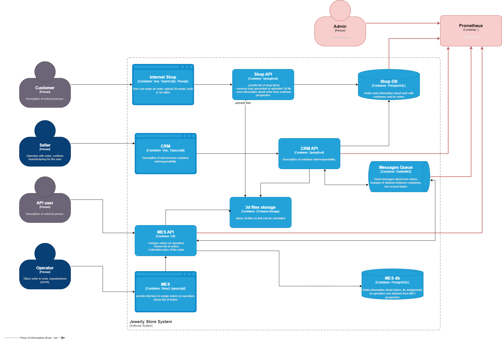

## Анализ системы компании и C4-диаграммы в контексте планирования трейсинга

Места, где заказ может «сломаться» или зависнуть - получение и обработка заказа.

**Список данных, которые должны попадать в трейсинг**
 - Прием заказа в Shop API
 - Получение заказа CRM API
 - Отправка заказа в RabbitMQ
 - Получение заказа MES API 

## Мотивация

Почему в систему нужно добавить трейсинг и что это даст компании:

1. Позволит ускорить выявление проблемы с пропажами заказов
2. Оперативно принимать меры для исполения проблемных заказов до обращения клиентов
3. Упростить работу специалистов техподдержки
4. Мониторить активность клиентов (бизнес-метрика количество поступивших заказов в MES API)
5. Оценить эффективность системы (бизнес-метрика количество не обработанных заказов и количество обработанных заказов)
6. Выявить проблему обработки заказа (бизнес-метрика длительность ожидания необработанных заказов)
7. Оценить длительность исполнения заказов (бизнес-метрика длительность исполнения заказов)

## Предлагаемое решение

Трейсинг предлагается реализовать с помощью Prometheus. У него много клиентских библиотек под основные языки программирования, 
поэтому встроить его в приложение будет достаточно просто. Prometheus обладает широкими возможностями алёртинга, 
собственным языком запросов PromQL, а также базовыми средствами визуализации данных.
Потребуется внедрить агенты Prometheus в Shop API, CRM API, MES API. Реализовать микросервис-подписчик RabbitMQ.
Автоматический мониторинг процесса прохождения заказа и алертинг может быть реализован средствами собственного 
языка запросов PromQL в Prometheus.

## Компромиссы

Трейсинг будет невозможен, если система не позволяет применить в коде агенты Prometheus.

## Аспекты безопасности

Во всех приложениях есть аутентификация и авторизация. Дополнительных мер для предотвращения несанкционированного доступа не потребуется.
Доступ к средствам визуализации данных Prometheus необходимо обеспечить только пользователям с ролью "Администратор". 
