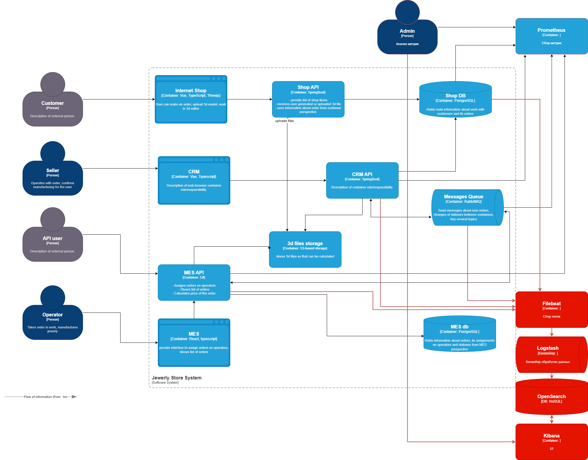

## Анализ системы компании и C4-диаграмму в контексте планирования логирования

Сбор логов требуется из систем: 

 - Shop API
 - CRM API
 - RabbitMQ
 - MES API 

**Список необходимых логов с уровнем INFO:**

 - временная метка
 - номер заказа
 - текущее состояние заказа
 - выполняемое действие с заказом
 - название функции 
 - название сервиса
 - идентификатор инстанса
 - идентификатор покупателя

Лог должен быть на входе в функцию (до начала обработки) и на выходе с результатом обработки. 
Уровень ERROR использовать при ошибках.

## Мотивация

**Почему в систему нужно добавить логирование и что это даст компании**

1. Сокращение времени на поиск и выявление ошибки
2. Возможность анализа сложных ошибкок
3. Понижение количества ошибок (Техническая метрика)
4. Увеличение скорости выполнения функций за счет сокращения времении на анализ ошибок и информации о действиях системы (Техническая метрика - Длительность операций)
5. Снижение длительности обработки заказа - за счет сокращения времении на анализ ошибок и информации о действиях системы (Бизнес-метрика )
   
Для решения главной проблемы приложения в первую очередь нужно настроить логирование и трейсинг от сервисов получения и обработки заказа.

## Предлагаемое решение

1. Установка ELK (Filebeat + Logstash + OpenSearch + Kibana)
2. Подключение сервисов к сбору логов 
3. Доработка сервисов на отправку сообщений типа INFO о заказах
4. Доработка сервисов на отправку сообщений типа ERROR об ошибках
5. Настройка отправки сообщений в случае выявления проблем с задержками заказов

**Безопасность**

1. Доступ к логам должен осуществляться в соответсвии с доменной политикой компании (логин/пароль, доменная УЗ, SSO)
2. Персональные данные (клиентские ФИО, телефоны, платежная информация) должны быть зашифрованы.

**Хранение логов**

|     Индекс     |Длительность хранения| Размер |             Примечание                   |
|----------------|---------------------|--------|------------------------------------------|
|ID сервиса      |      2 недели       |   4Б   | Исходя из длительности выполнения заказа |
|ID заказа       |      2 недели       |   4Б   |                                          |
|Название функции|      2 недели       |  30Б   |                                          |
|Дата лога       |      2 недели       |   8Б   |                                          |
|Сообщение       |      2 недели       | 300Б   | Минимальный размер                       |

Размер дискового пространства необходимо рассчитвать исходя из количества событий за период хрнанения + запас (100%) + системное хранение. 
Предположим, что на конец года будет 1000 заказов\мес. Один заказ - 4 сервиса. Один сервис - 2 события (INFO/ERROR). Одно событие - 342Б.
Итого: 1000 * 4 * 2 * 342 = 2736 КБ в месяц, т.е. самый простой SSD на 16 ГБ позволит держать данные за месяц с запасом.

**Мероприятия для превращения системы сбора логов в систему анализа логов**

1. При возникновении ошибки направлять уведомление администратору.
2. Возникновение массового количества ошибок от одного сервиса - оповещение администратора
3. Неправильные вводы паролей - блокировка IP и оповещение администратора 
4. DDoS должны выявляться на этапе Мониторинга и там приниматься решения о защите системы
